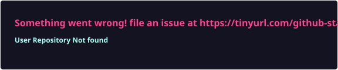

# Richard Rodas

**Full Stack Developer · Angular · React · Nest.js**

📍 Lima, Peru

<!-- TODO: add LinkedIn badge

-->

## About me

- 🏦 **5+ years** building complex web applications, mostly for the **banking and financial sector**.
- 📰 Built a weekly blog platform for **100,000 employees** with Angular 21, Nx, PrimeNG, Tailwind and Cypress.
- ⚡ Migrated a legacy ASP.NET + Angular system to **Nest.js + React microservices**, improving performance by **50%**.
- 🔐 Designed a **Single Sign-On** system that unified employee access across an organization's applications.
- 🤖 Integrate **LLMs, RAG and autonomous agents** into production products.
- 🚀 Founder of **Magrolabs**, a D2C supplements brand whose entire tech stack I build and run solo.

🌎 Spanish (native) · English (C1) · Portuguese (professional)

## Tech stack

  
   
  
   
  

## GitHub stats

  
  

## Recent projects

  
  
  
  

> 💼 Much of my professional work lives in private client repositories, so it doesn't show up here.
